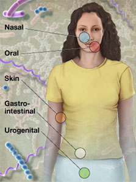
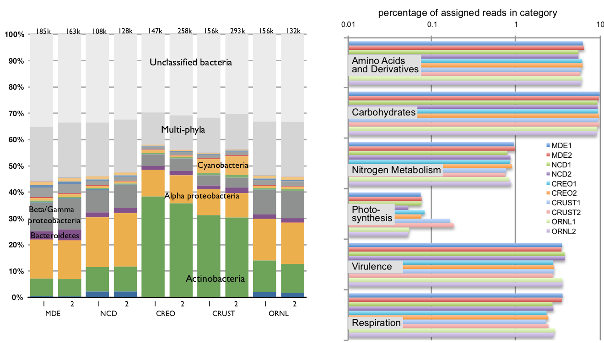
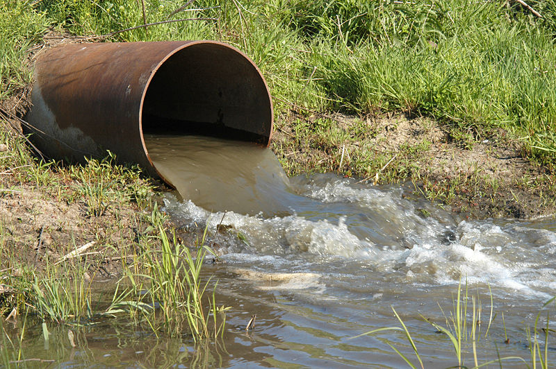
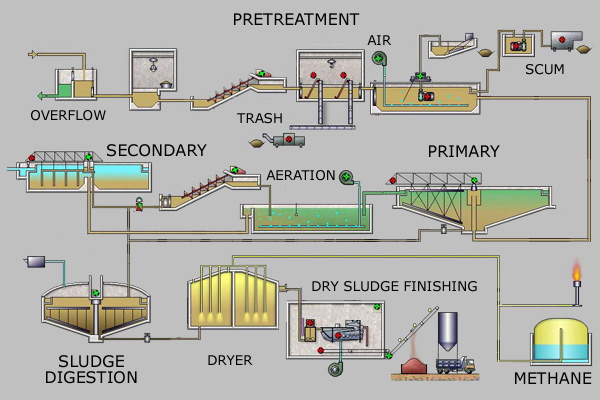
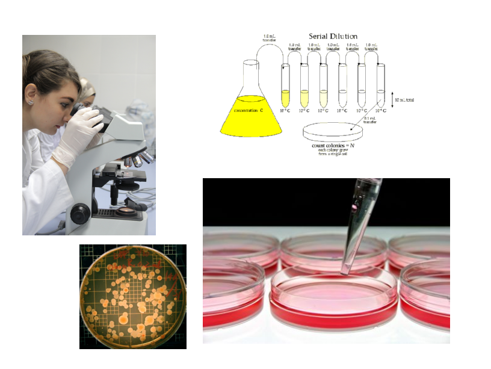

SWAMP
================================================================================

<h2>Sewage Water Analysis</h2>
<h2>Metagenomic Platform </h2>

[David Montaner](http://www.dmontaner.com/)

**[CIPF](http://bioinfo.cipf.es/)**

_(17-01-2014)_ 

in Valencia

<!-- slide -->
================================================================================
Metagenomics
-------------------------------------------------------------------------------

\ 

**Metagenomics**: the study of genetic material collected from a mixed community of organisms.  

\ 

- usually refers to the study of microbial communities
- but may be applied to explore any mixture of organisms

- research started with environmental samples
- but clinical applications have been developed just after

Publications: environment
-------------------------------------------------------------------------------

<iframe src="http://www.ncbi.nlm.nih.gov/pubmed/15001713" style="width:100%;height:70%"></iframe>

<http://www.ncbi.nlm.nih.gov/pubmed/15001713>

Publications: water
-------------------------------------------------------------------------------

<iframe src="http://www.ncbi.nlm.nih.gov/pubmed/21915244" style="width:100%;height:70%"></iframe>

<http://www.ncbi.nlm.nih.gov/pubmed/21915244>

Publications: other environment
-------------------------------------------------------------------------------

<iframe src="http://www.ncbi.nlm.nih.gov/pubmed/24412260" style="width:100%;height:70%"></iframe>

<http://www.ncbi.nlm.nih.gov/pubmed/24412260>

Publications: human microbiome
-------------------------------------------------------------------------------

<iframe src="http://www.ncbi.nlm.nih.gov/pubmed/21682646" style="width:100%;height:70%"></iframe>

<http://www.ncbi.nlm.nih.gov/pubmed/21682646>

<!-- slide -->
================================================================================
Human microbiome project
-------------------------------------------------------------------------------

<iframe src="http://commonfund.nih.gov/hmp/index" style="width:100%;height:70%"></iframe>

<http://commonfund.nih.gov/hmp/index>

Human microbiome sites
-------------------------------------------------------------------------------

\ 

<!-- slide -->
================================================================================
Metagenomic experiments
-------------------------------------------------------------------------------

- Extract DNA: Metagenomics
    + whole genome
	+ specific genes
	    * 16S
		* 18S
- Extract RNA: Meta transcriptomics

\ 

Questions

- which _known_ organisms are present
- which _unknown_ organisms are present
- which genes/functions are _present_
- which genes/functions are _active_

<!-- slide -->
================================================================================
Advantages & Benefits
-------------------------------------------------------------------------------

\ 

- relative quantification

- using NGS can detect very low abundance organisms
    + relative
	+ absolute

- can explore non-cultivable microorganisms

<!-- slide -->
================================================================================
16S / 18S metagenomics
-------------------------------------------------------------------------------

- __16S__ ribosomal RNA: prokaryotic (__1542__ nt)
- __18S__ ribosomal RNA: eukaryotic (__1869__ nt)

\ 

- highly conserved regions: use universal primers
- hypervariable regions: species-specific signature

\ 

Databases

- [Ribosomal Database Project](http://rdp.cme.msu.edu/) ~ 3 million
- [SILVA](http://www.arb-silva.de/) ~ 4 million 
- [EzTaxon](http://oklbb.ezbiocloud.net/)
- [Greengenes](http://greengenes.lbl.gov/cgi-bin/nph-index.cgi) 

<!-- slide -->
================================================================================
Bioinformatics pipeline
-------------------------------------------------------------------------------

\ 

In summary: 

\ 

- map NGS reads against all known 16S / 18S genes

- quantify the species

<!-- slide -->
================================================================================
Results: one sample
-------------------------------------------------------------------------------

<iframe src="http://krona.sourceforge.net/examples/rdp.krona.html" style="width:100%;height:70%"></iframe>

<http://krona.sourceforge.net/examples/rdp.krona.html>

<!-- slide -->
================================================================================
Results: compare between samples
-------------------------------------------------------------------------------

Results: by microbial type
-------------------------------------------------------------------------------

<!-- slide -->
================================================================================
Results: Functional Profiling
-------------------------------------------------------------------------------

Wastewater
================================================================================

<!-- slide -->
================================================================================
Sewage treatment plant
-------------------------------------------------------------------------------

Mostly a biological treatment:

_bacterial_ degradation of organic matter

<!-- slide -->
================================================================================
Biological treatment
-------------------------------------------------------------------------------

- Secondary treatment: degrade the biological content.
Aerobic microorganisms.

- Tertiary treatment: remove nitrogen, phosphorus, etc.
Anaerobic microorganisms.

- Disinfection.   Control for _pathogenic_ microorganisms.

\ 

The microbial communities in the bioreactor and 
other areas of the treatment plant must be __optimal__ 
to improve performance.

Inadequate biological treatment
-------------------------------------------------------------------------------

- biological digestion is not properly done
- too much algae proliferation
- increment in pathogen microorganisms 

\ 

- longer treatment times
- more chemical treatments needed
- more energy consumption

\ 

- more expensive
- less safety for health and environment

<!-- slide -->
================================================================================
Water Screening: State of the art
-------------------------------------------------------------------------------

- microscope count
- cell culture

<!-- slide -->
================================================================================
<!-- slide -->
-------------------------------------------------------------------------------

\ 

<h1>Can we use METAGENOMICS?<h/1>

EXPLORA TECNOLOGIA
================================================================================

SWAMPer

<!-- slide -->
================================================================================
Objective
-------------------------------------------------------------------------------

SWAMP proposal:

pilot study to attempt

sewage water analysis

using _next generation sequencing_ 

and metagenomics

Main objectives:

- Is a unique sample representative?
- Will work for any treatment plant?
- Will improve standard methodologies?
- Which is the minimum amount of water?

<!-- slide -->
================================================================================
Study
-------------------------------------------------------------------------------

- Take water form 7 treatment plants in Valencia
- 8 different places in the bioreactor

\ 

- Sequence with decreasing amounts of water
- Compare within treatment plant
- Compare with the standards

Treatment Plants In Valencia
-------------------------------------------------------------------------------

1. El Palmar
2. Massarrojos
3. Pinedo 1
4. Pinedo 2
5. Vera
6. El Saler
7. El Perellonet

<!-- slide -->
================================================================================
Long term objectives
-------------------------------------------------------------------------------

Next Explora?

\ 

- cheap kit for DNA _outdoors_ stabilization 
- cheap NGS
- more specific primers
- speed up computation
- curate and combine databases
- distribution logistics

<!-- slide -->
================================================================================
Questions
-------------------------------------------------------------------------------

